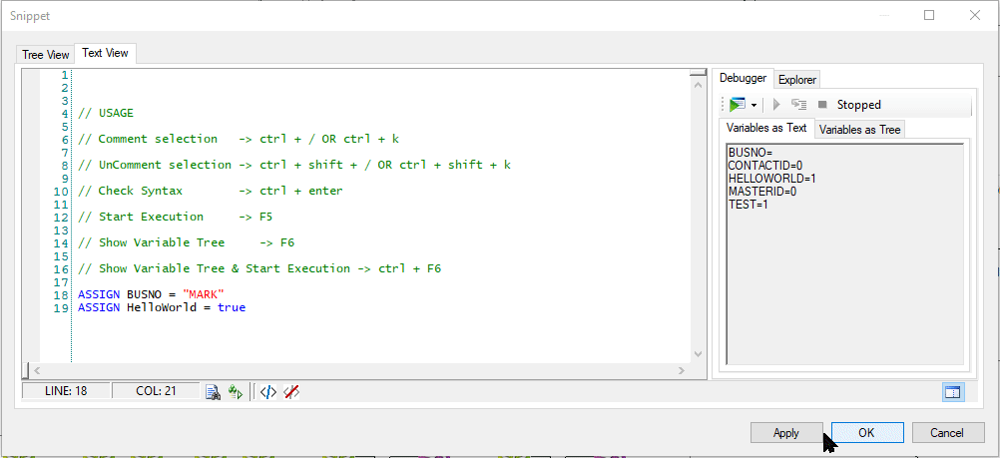

# nicedent
NICE inContact Studio - Snippet Editor Hotkeys

## USAGE
    
|Shortcut Name|Hotkey|
|--|--|
| Comment selection | <kbd>⌃ Ctrl</kbd> + <kbd>/</kbd>   <kbd>⌃ Ctrl</kbd> + <kbd>K</kbd> |
| Uncomment selection | <kbd>⌃ Ctrl</kbd> + <kbd>⇧ Shift</kbd> + <kbd>/</kbd>   <kbd>⌃ Ctrl</kbd> + <kbd>⇧ Shift</kbd> + <kbd>K</kbd> |
| Check Syntax | <kbd>⌃ Ctrl</kbd> + <kbd>↵ Enter</kbd> |
| Start Execution | <kbd>F5</kbd> |
| Show Variable Tree | <kbd>F6</kbd> |
| Show Variable Tree & Start Execution | <kbd>⌃ Ctrl</kbd>+<kbd>F6</kbd> |

## DEMO

